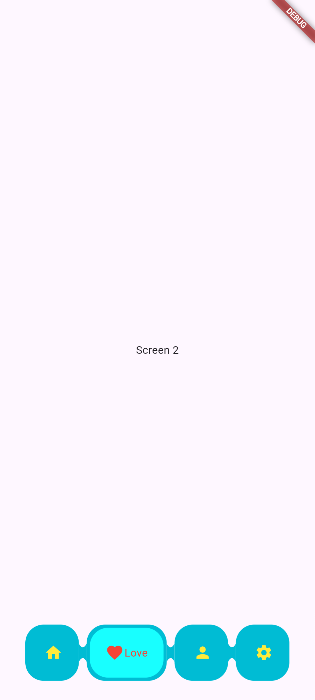
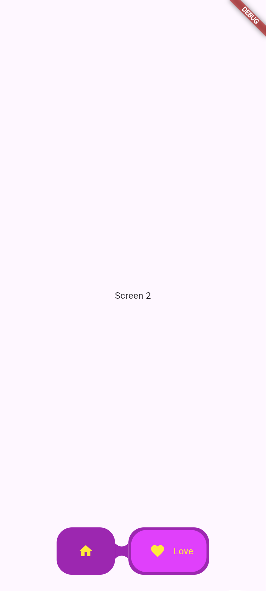
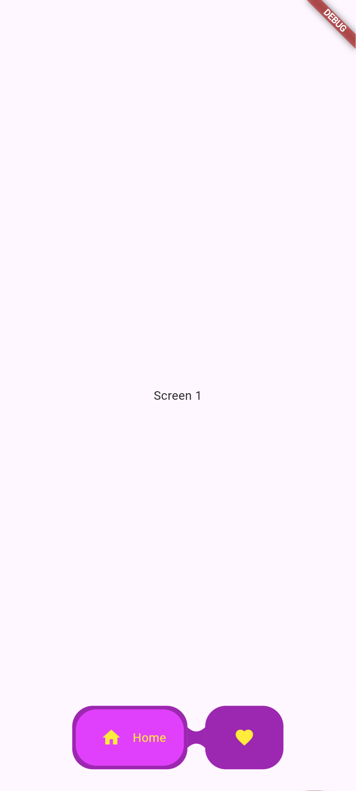

# Fancy Custom NavBar

A beautiful, animated, and customizable bottom navigation bar with SVG support and concave dividers.


---

## ✨ Features

* Easy to use widgets
* Customizable concave/convex shapes
* Lightweight and fast
* Supports Flutter Web, iOS, Android

---

## 📦 Installation

Add this to your `pubspec.yaml`:

```yaml
dependencies:
  fancy_custom_navbar: ^0.0.1
```

Run:

```sh
flutter pub get
```

## 🖼️ Use Case Preview

Below are example images showing how this package can be used:

### Example 1


### Example 2


### Example 3


---

## ⚠️ Limitations

* **Maximum 4 items** are supported across all devices.
* **Long labels are not allowed** (short labels recommended for best UI).

---

## 📐 Customization

You can customize:

* `selectedColor`
* `unselectedColor`
* `innerContainerColor` & `outerContainerColor`
* `NavBarItem`

Example:

```dart
BottomNavigation(
          currentIndex: selectedScreen,
          onTap: (newIndex) {
            setState(() {
              selectedScreen = newIndex;
            });
          },
          items: const [
            NavBarItem(label: "Home", icon: Icons.home),
            NavBarItem(label: "Love", icon: Icons.favorite),
            NavBarItem(label: "Profile", icon: Icons.person),
            NavBarItem(label: "Setting", icon: Icons.settings),
          ],
          selectedColor: Colors.red,
          unselectedColor: Colors.yellow,
          innerContainerColor: Colors.cyanAccent,
          outerContainerColor: Colors.cyan,
        ),
```

---

## 📂 Folder Structure

```
your_package/
│
├── lib/
│   └── fancy_custom_navbar.dart
│   └── src/
│        └── bottom_navigation.dart
│        └── concave_clipper.dart
│        └── nav_bar_item.dart
├── images/
├── images/
└── README.md
```

---

## 🤝 Contributing

Pull requests are welcome! For major changes, please open an issue first to discuss what you'd like to change.

---

## 📄 License

This project is licensed under the MIT License.

---

Made with ❤️ using Flutter
